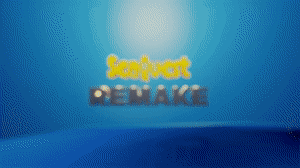
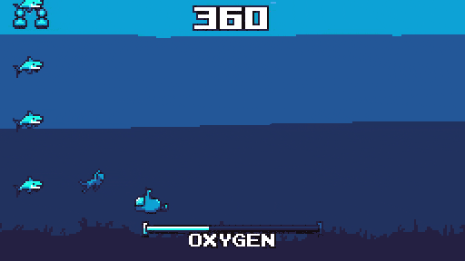
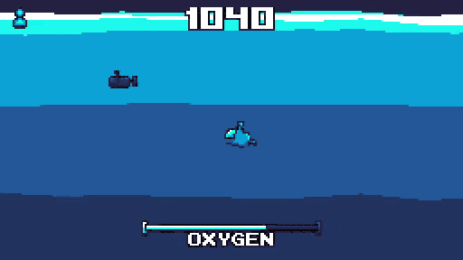

# SeaQuest Remake AKA. SEADEFENDER

Yes, very messy project indeed, I do know folders exist.
But I had to crunch deadlines, no time to organize, you know?

Also please note this project is aimed for Godot 3.0.

Anyways, if you wanna readup more on this crazy project and it's future, you can read my [blog post here.](https://plug-world.com/posts/seadefender/)

TLDR: This project was initially abandoned, and picked up again for a game dev compotetion. And now it's turning into a Udemy course. It's been a wild ride!

